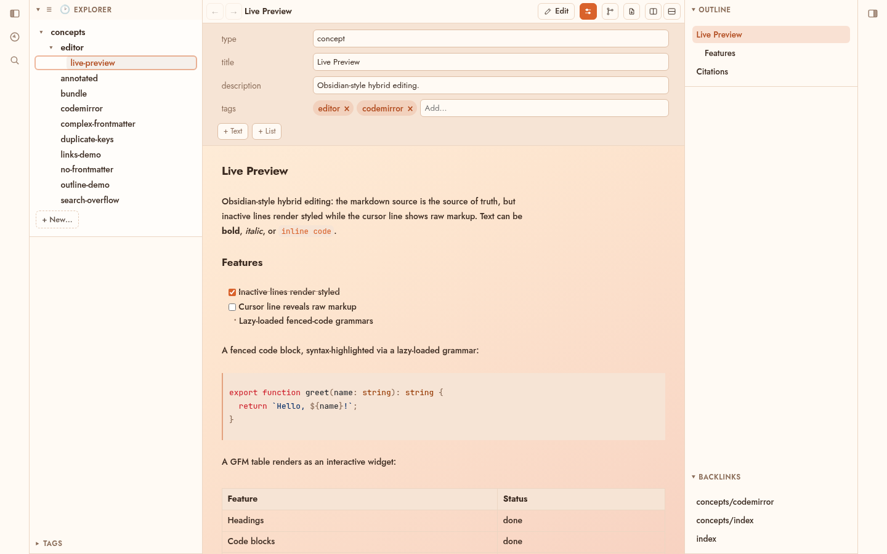
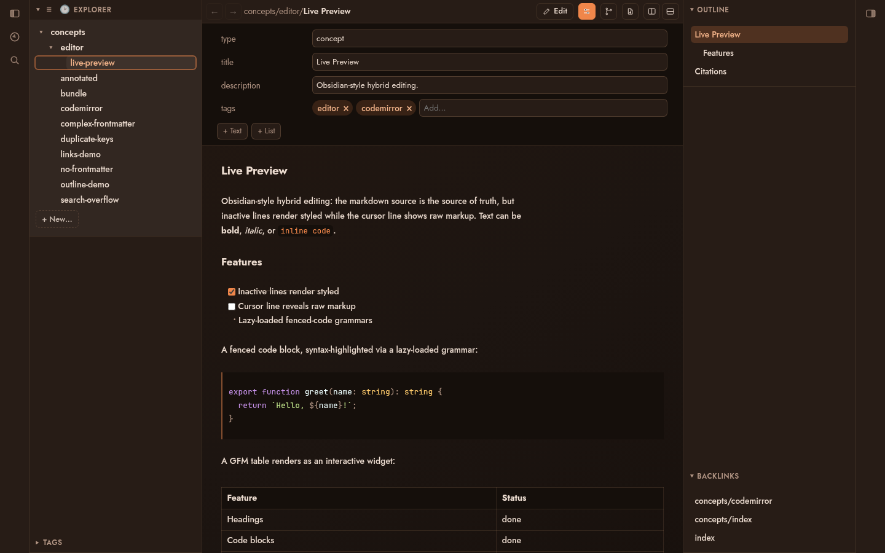
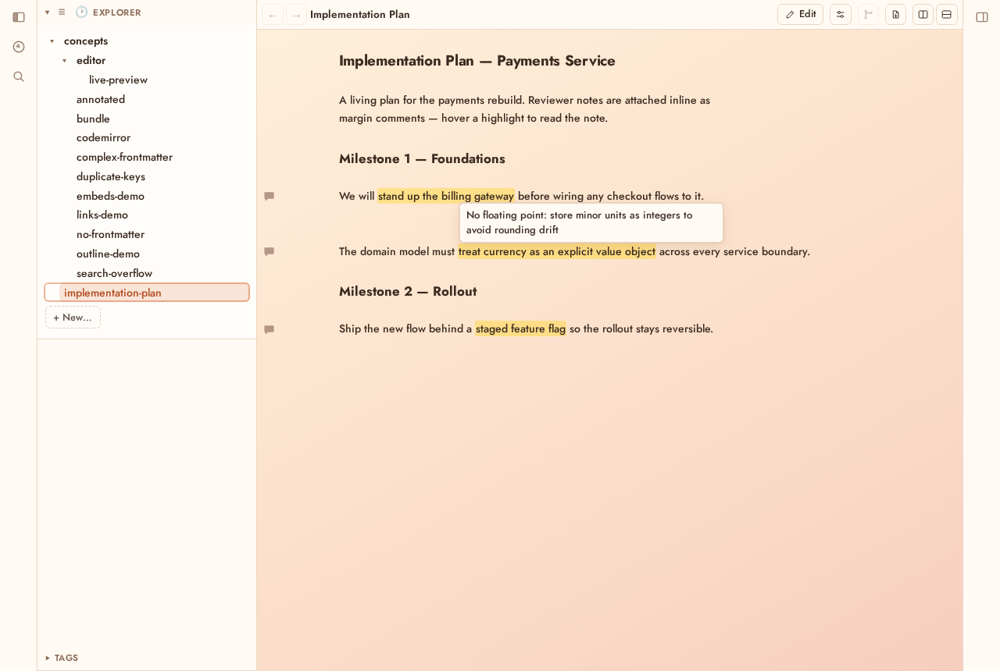
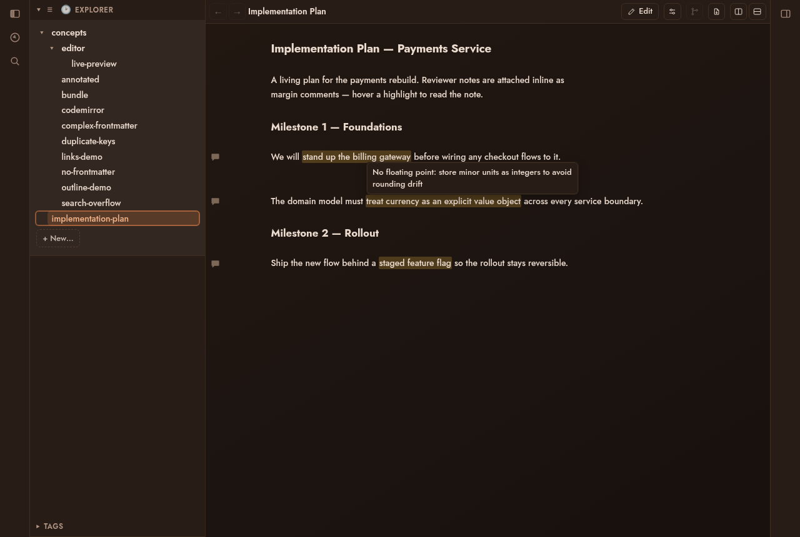

<div align="center">


# Sunstone

**The markdown editor for git users. A slimmed-down Obsidian.**

</div>

Sunstone is a desktop markdown editor with the knowledge-base features you'd
otherwise assemble from plugins: live preview, wikilinks, backlinks,
properties, tags, and full-text search. It opens a plain folder of markdown
files. Your repo is the sync layer; you diff, review, and collaborate through
git commits instead of a sync service.

---

## Open any folder. No vault required.

No vault to create, import, or convert into. Sunstone runs against any folder
of markdown files. Point it at your notes, a docs repo, or a cloned knowledge
base and start editing. Files stay plain `.md` on disk. Nothing gets indexed
into a database you can't grep.

## Built for the Google Open Knowledge Format

Sunstone implements the
[Open Knowledge Format (OKF)](https://cloud.google.com/blog/products/data-analytics/how-the-open-knowledge-format-can-improve-data-sharing/),
Google's open standard for sharing knowledge as markdown bundles.

OKF is minimal by design: a directory of markdown files with YAML frontmatter
describing typed concepts. No schema registry, no central authority, no
required tooling. If you can `cat` a file you can read OKF; if you can
`git clone` a repo you can ship it. Humans, agents, and other editors all read
the same files, with nothing to migrate.

Sunstone's frontmatter model (the typed-concept `type` / `title` / `tags`
fields, reserved files, and bundle structure) conforms to the OKF spec:

- Upstream spec: <https://github.com/GoogleCloudPlatform/knowledge-catalog/blob/main/okf/SPEC.md>
- Vendored copy in this repo: [`docs/okf/spec.md`](docs/okf/spec.md)

## Features

- **Live preview.** Obsidian-style hybrid editing. Inactive lines render
  styled, the cursor line shows raw markup. Syntax-highlighted fenced code,
  task lists, and interactive GFM tables.
- **Wikilinks and backlinks.** Follow links between concepts. Every concept
  shows which others link to it.
- **Properties panel.** Edit typed frontmatter as structured fields (scalars,
  lists, tags). Complex YAML round-trips verbatim.
- **Review changes.** Toggle a diff of the working tree against `HEAD`, or
  step back through history. Word edits render as CriticMarkup track-changes.
- **Tag browser.** Browse and filter the bundle by tag, with live counts.
- **Full-text search.** Search every concept, with snippet results.
- **Quick-nav palette.** Jump to any concept by fuzzy name match.
- **Outline panel.** A live heading outline of the open concept.
- **Annotations.** Select text and choose **Add comment** from the right-click
  menu (or press `Ctrl/Cmd+Alt+M`) to attach a margin comment. Works in
  reading mode too. The highlighted span is marked, a comment icon sits in the
  gutter, hovering shows the note, and clicking the icon reopens the popup to
  edit or remove it. On disk each note is plain
  [CriticMarkup](http://criticmarkup.com/) (`{==text==}{>>note<<}`), so
  comments travel in git and any other tool can read them. Useful for leaving
  feedback on generated docs for an agent's next pass.
- **Right sidebar.** A second, collapsible sidebar housing Backlinks.
- **Light and dark theming.** A warm amber palette that follows the OS color
  scheme.

## Screenshots

A concept open against a real OKF bundle, with Explorer, Properties, live
preview, Outline, Backlinks, and the Tag browser on screen.

### Light



### Dark



### Annotations

Margin comments on an implementation plan: highlighted spans, gutter comment
icons, and a hovered note. The annotations are CriticMarkup in the underlying
`.md`; the editor renders them out of the text flow.





## Development

Sunstone is built with [Tauri](https://tauri.app/),
[SvelteKit](https://svelte.dev/docs/kit), and TypeScript.

```sh
bun install          # install dependencies
bun run tauri dev    # run the desktop app
bun run build        # build the static SPA
bunx playwright test # run the end-to-end suite
```

### Web deployment

Sunstone also ships as a single Docker image that serves a Bundle in the
browser. The base deployment is read-only: no write secret, unauthenticated
reads. A git-synced stack runs it writable, with every save committed and a
sync loop reconciling against your git remote (the server clones your origin
and syncs it itself, no sidecar).

[`docker/README.md`](docker/README.md) covers the `docker compose` run, the
internal-network / unauthenticated-reads caveat, the three deployment shapes
(plain / git-local / git-synced) with the environment reference, and how to
publish the image to GHCR and install it on a remote. This is separate from
the desktop release flow.

## License

MIT
