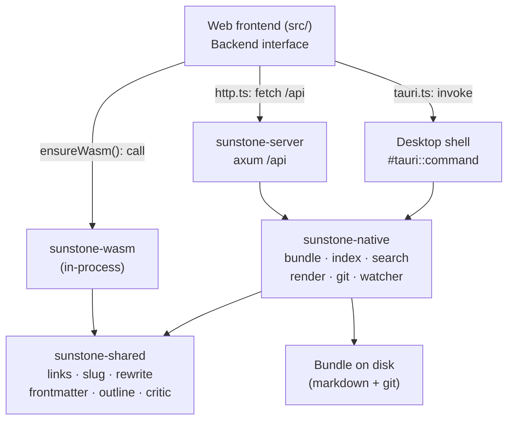
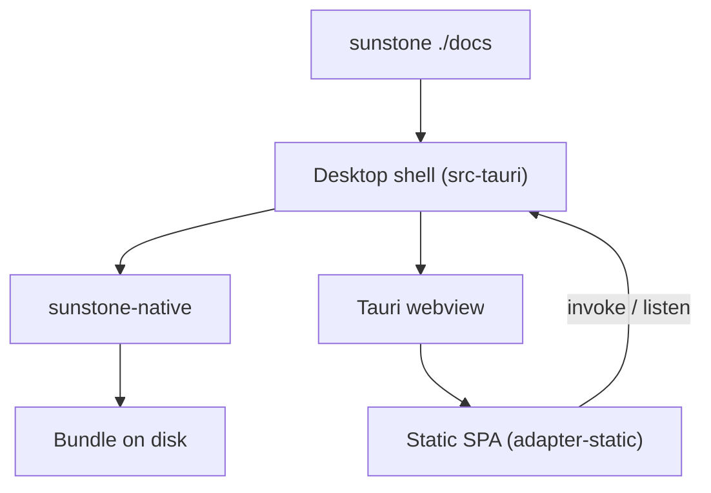
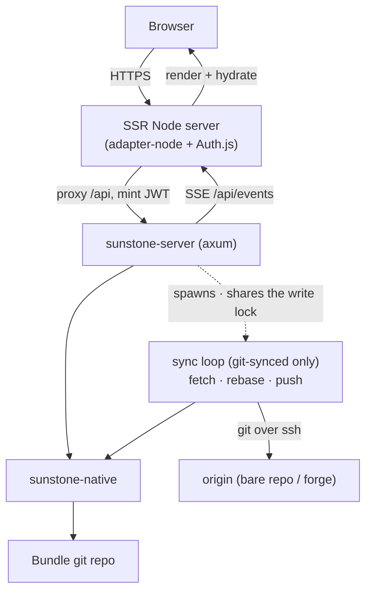

# Architecture overview

Sunstone is one codebase that ships two products — a **desktop editor** and a **web viewer with an authenticated, optionally git-synced edit path** — over a **shared Rust domain core**. The packages:

| Package | Language | Role |
| --- | --- | --- |
| [sunstone-shared](/architecture/sunstone-shared.md) | Rust | Pure leaf crate of frontend-shared algorithms — compiled to **both** native and wasm. |
| [sunstone-native](/architecture/sunstone-native.md) | Rust | Host-agnostic Bundle IO/index/git logic — the native hub, built on `shared`. |
| `sunstone-wasm` | Rust→wasm | Thin `wasm-bindgen` bridge over `shared`, loaded in-process by the frontend. |
| [Desktop shell](/architecture/desktop-shell.md) (`src-tauri`) | Rust | Thin Tauri 2 wrapper exposing native over IPC commands. |
| [sunstone-server](/architecture/sunstone-server.md) | Rust | axum HTTP binary exposing native over a JSON/SSE API — and, in the git-synced deployment shape, the owner of the **git sync loop**. |
| [Web frontend](/architecture/web-frontend.md) (`src/`) | SvelteKit | One UI that targets both hosts, decoupled by the IPC seam. |

## The central idea

Domain behaviour lives **once** and is reused rather than reimplemented, along two axes:

- **IO / backend logic** — filesystem, index, search, render, git, watcher, config — lives in [sunstone-native](/architecture/sunstone-native.md). The desktop shell and the server are each a thin transport layer over it.
- **Pure algorithms** — link resolution, wikilink/slug, anchor rewrite, frontmatter parse, outline/CriticMarkup/citation scanners — live in [sunstone-shared](/architecture/sunstone-shared.md), compiled to **both** native (so `sunstone-native` calls them directly) and **wasm** (so the frontend runs the *same* code in-process, synchronously, against the live editor buffer — [ADR 0006](/adr/0006-wasm-shared-core-for-frontend-logic.md)). No TS twin of that logic remains.

The frontend reaches whichever backend is present through a single `Backend` interface, and reaches the pure logic through the loaded wasm module. No feature logic is duplicated across hosts.

## Desktop path

`sunstone ./docs` launches the [desktop shell](/architecture/desktop-shell.md). The frontend is a static SPA (adapter-static) loaded into a Tauri webview; `isTauri` selects the `tauri.ts` backend, whose methods are `invoke(...)` calls to the shell's `#[tauri::command]`s. The shell delegates each to [sunstone-native](/architecture/sunstone-native.md) and runs core's filesystem watcher, emitting change events back over Tauri IPC. Everything is in one process on the user's machine; there is no network and no auth, and the desktop never commits to git.

## Web path

Sunstone Web is **two processes** behind one public origin. The SvelteKit app is built with adapter-node (SSR) and run as a Node server; it owns the origin, renders the [WebViewer](/architecture/web-frontend.md), handles Auth.js sign-in, and proxies `/api/*` to the [sunstone-server](/architecture/sunstone-server.md) Rust binary on an internal port. The frontend's `http.ts` backend talks only to that same-origin `/api`. Reads are open; on a write — and on the two gated history reads, `/api/history` and `/api/file-at-rev` — the Node proxy mints a short-lived HS256 JWT from the session and forwards it, which the server verifies before committing through core's git primitive. Live updates flow server → browser over SSE (`/api/events`).

A web deployment takes one of **three shapes**, derived from the *presence* of `SUNSTONE_GIT_*` configuration rather than any mode flag: **plain** (a folder, no git, Save writes the file), **git-local** (commits stay in the container) and **git-synced** (the server clones an origin on boot and runs the sync loop, so web edits and external `git push`es reconcile continuously). Only git-synced spawns the loop, and only it exposes the operator route `/api/sync-status`. The loop takes the same in-process write lock the write path takes, and its in-place rewrites reach browsers through the ordinary watcher → SSE path; the two outcomes users must know about — a conflicting edit forked beside the original, or a web deletion dropped — arrive as a named `sync` event on that same connection. See [ADR 0007](/adr/0007-server-owns-the-git-sync-loop.md), and the [Glossary](/GLOSSARY.md) for the shape vocabulary.

Both processes ship as a single Docker image, running non-root; see `docker/README.md` for the three stacks, the normative env/volume table, and the internal-network / open-reads caveat.

## What crosses each seam

- **Same types both ways.** Whether over Tauri IPC or HTTP, the payloads are the [sunstone-native](/architecture/sunstone-native.md) serde structs (`camelCase`), mirrored in the frontend's `src/lib/types.ts`. The `Backend` interface hides which transport is in play.
- **Bundle-relative, forward-slash paths** cross every seam; path-escape is rejected in core, so the server's network edge and the desktop's IPC edge share one guard.
- **Change events** originate in core's watcher and reach the frontend either as a Tauri event (desktop) or an SSE message (web) — the frontend's `onFileChanged` is identical.
- **In-process wasm, no transport.** The pure-logic seam is not a backend at all: after a one-time async `ensureWasm()`, the frontend calls [sunstone-shared](/architecture/sunstone-shared.md) (compiled to wasm) synchronously, in the browser, so CodeMirror decorations resolve against the live buffer without an IPC round-trip. SSR renders native Rust and never loads the wasm.

## Relationships

- Each package has its own page: [sunstone-shared](/architecture/sunstone-shared.md), [sunstone-native](/architecture/sunstone-native.md), [desktop shell](/architecture/desktop-shell.md), [sunstone-server](/architecture/sunstone-server.md), [web frontend](/architecture/web-frontend.md).
- The Bundle these packages operate on is defined in [OKF → Bundle](/okf/bundle.md); the link model core implements is [Linking](/okf/linking.md); the shared-crate/wasm rationale is [ADR 0006](/adr/0006-wasm-shared-core-for-frontend-logic.md) and the git-sync ownership rationale is [ADR 0007](/adr/0007-server-owns-the-git-sync-loop.md).
- How the assembled stacks are tested is [Testing](/architecture/testing.md).
