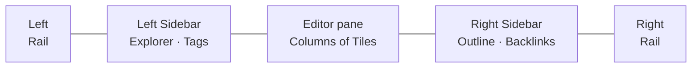

# App shell

The **app shell** is the top-level arrangement of [Panes](/GLOSSARY.md) inside the Sunstone window. `App.svelte` lays out three horizontal Panes, flanked on both outer edges by an [Activity Rail](/interface/activity-rail.md) — the strips of application-global controls, each outside the Sidebar it toggles:

- An **Activity Rail** is a thin, always-visible icon strip. Each carries its Sidebar's collapse toggle at the top; the left one also holds Quick nav, Search and a bottom user slot. A rail is *not* a Pane — it sits outside its Sidebar so it stays visible when that Sidebar collapses.
- The **left Sidebar** holds the **Explorer** and **Tags** Sections and starts expanded.
- The central **[Editor pane](/editor/editor-layout.md)** is a row of Columns, each a stack of Tiles — the app's primary surface. It is never hidden. Each Tile is topped by its own [Concept header](/interface/activity-rail.md) (the concept-scoped controls).
- The **right Sidebar** holds the **Outline** and **Backlinks** Sections and starts collapsed on a fresh Bundle.

Either Sidebar collapses entirely — to a literal 0 width, via the toggle at the top of its own [rail](/interface/sidebars.md) — letting the Editor pane take the full width. The Sidebar's edge is a drag-to-resize handle only. There is **no global nav bar**: the controls it once held are split between the Activity Rail (app-global) and each Tile's Concept header (concept-scoped). See [Activity Rail and Concept header](/interface/activity-rail.md).

## What lives where

| Pane | Sections | Default | Documented in |
| ---- | -------- | ------- | ------------- |
| Left Sidebar | Explorer, Tags | expanded (Tags collapsed, hidden if no tags) | [Sidebars](/interface/sidebars.md) |
| Editor pane | — (Columns of Tiles) | always visible | [Editor layout](/editor/editor-layout.md) |
| Right Sidebar | Outline, Backlinks | collapsed | [Sidebars](/interface/sidebars.md) |

**Properties** is neither a Pane nor a Section: it is chrome *inside* each Tile of the Editor pane, gated by one global show/hide flag toggled from the [Concept header](/interface/activity-rail.md). See [view state](/interface/view-state.md) for `propertiesShown`.

## The two web surfaces

The web build reuses this shell in two modes, keyed on whether a user is signed in:

- **Authenticated** — mounts the full desktop `App.svelte` shell (via `WebAppShellIsland`), inheriting both Activity Rails, the rail-toggled Sidebars and the per-Tile Concept header unchanged, with the web write path (explicit Save, concurrency gate).
- **Anonymous** — a read-only, server-rendered surface (`WebViewer`) that still carries the same two-rail Sidebar layout and interactive client islands (**Quick nav** and **Search**), plus a rail **Sign in** affordance. In place of the full Concept header it shows a **slim concept strip** (back/forward, Properties, export-PDF, theme toggle).

Both are described from the control side in [Activity Rail and Concept header](/interface/activity-rail.md).

## Relationships

- The shell hosts the two [Sidebars](/interface/sidebars.md) and the central [Editor pane](/editor/editor-layout.md), with the [Activity Rail and Concept header](/interface/activity-rail.md) carrying the controls (there is no global nav bar).
- Which surface owns the keyboard — and how `Alt`+arrows move between these Panes — is the [focus model](/interface/focus-model.md).
- Every collapse flag and the last-open layout survive relaunch via [view state](/interface/view-state.md).
- Terms are indexed in the [glossary](/GLOSSARY.md).
