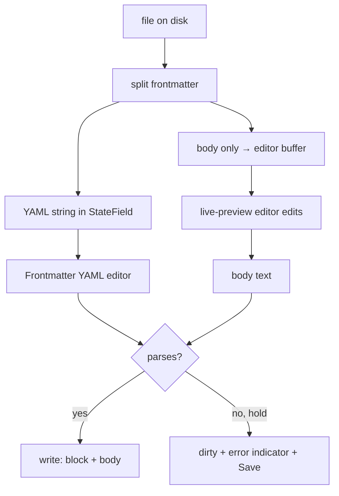

# Concept

A **[Concept](/GLOSSARY.md)** is a single unit of knowledge — **one `.md` file** inside a [Bundle](/okf/bundle.md). This page extracts the concept-level rules from the [OKF spec](/okf/spec.md) and records how Sunstone models a Concept's frontmatter and body, including where it extends or deliberately relaxes the spec.

## What OKF says

From [spec §4](/okf/spec.md#4-concept-documents) and [§2](/okf/spec.md#2-terminology):

- A Concept is a UTF-8 markdown file with two parts: a **YAML frontmatter block** (`---`-delimited) and a free-form **markdown body**.
- Its **Concept ID** is the file path within the Bundle **minus the `.md`** — `tables/users.md` ⇒ `tables/users`.
- **Frontmatter** ([§4.1](/okf/spec.md#41-frontmatter)) has exactly one **required** field, `type` (a short, self-describing, un-registered kind string). Recommended, in priority order: `title`, `description`, `resource`, `tags`, `timestamp`. Producers **MAY** add any keys; consumers **SHOULD preserve unknown keys** when round-tripping and must not reject documents for unrecognised fields.
- **Body** ([§4.2](/okf/spec.md#42-body)) is standard markdown; producers should favour structural markdown (headings, tables, lists, fenced code) over prose. Three headings carry **conventional** meaning: `# Schema`, `# Examples`, and — new in v0.2 — `# Computation`. The v0.1 `# Citations` body list is **superseded** by the `sources` frontmatter family ([§5.1](/okf/spec.md#51-provenance-sources), [§13.1](/okf/spec.md#131-breaking-changes)); consumers MAY still parse it for v0.1 documents.
- A Concept is [conformant](/okf/spec.md#11-conformance) if its frontmatter parses and `type` is non-empty; consumers must tolerate missing optional fields, unknown types, unknown keys, and broken links.

## How Sunstone models a Concept

### Frontmatter

Sunstone edits frontmatter as **YAML text**. While a Concept is open its block is held as a raw `string` in a CodeMirror `StateField` (`frontmatterField`) — the single source of truth — and the YAML is **stripped from the body document entirely** (the body buffer holds only the body). The text is shown and edited in a **second, small CodeMirror** inside the **Frontmatter** Region, with syntax highlighting, a language service (lint and, in an OKF Bundle, key completion) and an explicit format command. This is [ADR 0008](/adr/0008-raw-yaml-frontmatter-editing.md), superseding the structured `Property[]` model of [ADR 0003](/adr/0003-structured-frontmatter-reserialization.md) (itself superseding the in-place splice of [ADR 0002](/adr/0002-flat-frontmatter-model.md)).

Consequences that matter for spec conformance:

- **The block round-trips byte-for-byte.** Unknown keys, nested maps, block scalars, comments, quoting style, key order and the spec's own `{ by, at }` flow style all survive untouched, because nothing re-emits them — editing the body rewrites only the body. This is stronger than [§4.1](/okf/spec.md#41-frontmatter)/[§11](/okf/spec.md#11-conformance)'s "preserve unknown keys" requires, and it is what makes the nested v0.2 families ([§5](/okf/spec.md#5-provenance-trust-and-lifecycle)) authorable at all.
- **Formatting is explicit.** The format command reflows the block (preserving comments), but nothing reformats on save — otherwise every file would reflow merely on being edited.
- **The write is gated on parsing.** The debounced autosave writes only while the block parses; while it does not the write is held, the Concept stays dirty, and an error indicator plus a Save button appear. An explicit save writes regardless — losing the author's text is worse than a momentarily broken file. Because the write is whole-file, a held frontmatter write holds body edits with it.
- **`type` is checked only where the Bundle asked for it.** In a Bundle whose root `index.md` declares `okf_version` ([§12](/okf/spec.md#12-versioning)), the Frontmatter editor lints the block against the spec: the REQUIRED fields (`type`, a `sources` entry's `resource`, `generated.by`) are errors, everything else a warning, and only for the families the Concept uses — no `sources` key, no provenance findings. It also completes the §4.1 keys and the family keys. In every other Bundle it says nothing about OKF: `sunstone ./notes` opens any folder of markdown, and nagging that folder about `type` is what the removed required-`type` warning did ([ADR 0009](/adr/0009-marker-gated-okf-language-service.md)). Malformed YAML and duplicate keys are reported everywhere. No finding ever holds a write: the save gate asks only whether the YAML parses.
- **Reserved files get the Region too.** The spec says `index.md`/`log.md` carry no frontmatter, but real Bundles often give an index a `title` (which Sunstone reads for Explorer and Tile labels), so the Frontmatter Region shows for them like for any Concept (see [Bundle → reserved files](/okf/bundle.md#reserved-files)).



### Actors

Every identity-valued Frontmatter field — `generated.by`, `verified[].by`, a source's `author` — uses the [§7](/okf/spec.md#7-actor-convention) actor convention: `human:<id>` for a person, `process:<id>` for an automated process, `<producer>/<version>` for an agent or tool. Sunstone reads one with `sunstone_shared::actor::parse_actor` (Rust, and over wasm as `parseActor`), and shows one with `src/lib/actor.ts`: a kind chip (*person*, *process*, *agent*) before the id, an agent's version muted after it. The source hover card's **Author** row is the first surface; the trust and provenance families render through the same helper.

- **Never an error.** An empty string, a prefix the spec does not model (the spec's own example uses `team:`), a prefix with no id, or free text parses as `unknown` and displays as the raw string. No consumer rejects a Concept over an actor.
- **Round-trips unchanged.** The parse keeps the raw string; nothing rewrites an actor.
- **Prefixes are case-sensitive**, as written: `Human:dan` is `unknown`, so it does not count toward the human-reviewed trust tier ([§5.3](/okf/spec.md#53-trust-tiers)), which keys off `human:` alone (`Actor::is_human` / `isHumanActor`).
- **An agent splits at the last `/`**, so a producer may itself contain slashes (`acme/llm-wiki/1.2` → `acme/llm-wiki`, version `1.2`). A string with whitespace or a `:` is not an agent.

### Trust

`generated` records who produced the current content and when; `verified` lists who confirmed it and when ([§5.2](/okf/spec.md#52-trust-generated-and-verified)). Sunstone reads both with `sunstone_shared::trust` (Rust, and over wasm as `trustOf`) and shows them as a **trust line** above the body, in the editor (hybrid and reading) and in the native render (web viewer, print): the derived [trust tier](/GLOSSARY.md) first, then *Generated by* the actor and date, then *Verified* with each event's actor and date. Like the Sources section it is never written to the file.

- **The tier is derived, never stored** ([§5.3](/okf/spec.md#53-trust-tiers)): no `verified` key (or no events in it) is *Unverified*, events by non-`human:` actors only are *Machine-confirmed*, any `human:` actor is *Human-reviewed*. It is recomputed from `verified` on every edit; `generated.by` plays no part.
- **A bare mapping is one event.** `verified: { by, at }` without the list dash reads as a one-element list, as §5.2 requires; it is legal, so it gets no lint finding, and since nothing re-emits the block (ADR 0008) editing never turns it into a list or back.
- **Degrade, don't drop.** A `generated` without `by` still shows, as *Generated by unknown*; an `at` that is not ISO 8601 with an explicit UTC offset is shown as written. A datetime that is ISO shows as its date, with the full value on hover.
- **Legacy `timestamp`.** v0.1's `timestamp` is superseded by `generated.at` ([§13.1](/okf/spec.md#131-breaking-changes)). When `generated` is absent, Sunstone shows `timestamp` as the generation time, without a tier (the Concept has no v0.2 trust keys). Completion offers `generated`, never `timestamp`.
- **Absence is fine.** A Concept with none of these keys gets no trust line and no finding.
- **Lint** (OKF Bundles only, [ADR 0009](/adr/0009-marker-gated-okf-language-service.md)): `generated` without `by` is an error; an `at` that is not ISO 8601 with an offset, a `generated` that is not a mapping, a `verified` that is neither a list nor one mapping, and an event missing `by` or `at` are warnings. Completion offers the current UTC time at an `at` and the `human:` / `process:` prefixes at a `by`.

### Attested Computation

A Concept whose `type` is `Attested Computation` (case aside) is a computation with a contract, the one Concept type OKF v0.2 adds ([§10](/okf/spec.md#10-attested-computations-concept)). Sunstone reads the contract with `sunstone_shared::computation` (Rust, and over wasm as `contractOf` / `isAttestedComputation`) and shows it as a **contract card** after the trust line, in the editor (hybrid and reading) and in the native render (web viewer, print): *Runtime*, *Parameters* (each `name`, its `type`, and *required* / *optional* when `required` is given), *Computation*, *Executor* with its *Receipt* names, *Attester*. Like the trust line it is never written to the file; the contract is edited as YAML in the Frontmatter Region.

- **Display only.** Nothing is executed, run or verified: v0.2 defers the runtime protocol, the receipt and verdict formats and the attester ABI, so the card has no run or check action.
- **Path-valued fields link like any in-Bundle link** ([§6.2](/okf/spec.md#62-path-valued-fields)). `computation`, `executor.resource` and `attester.resource` are links: a URL opens in the browser, `/x` resolves under the detected Bundle root, anything else relative to the Concept (so `references/…` sits beside it). The editor opens them through the same `onLinkClick` → `resolveLink` as a body link; the native render marks them with the same `link_attrs` (so a target that is not a Concept, such as `references/attesters/revenue.py`, is marked broken exactly as a markdown link to it would be).
- **Permissive.** Every contract key may be missing; a missing key is simply not shown, and a contract with no keys at all gets no card. A key of the wrong shape reads as absent (a `required` that is not a boolean is not shown; a bare `receipt: job_id` reads as one name).
- **Another type gets nothing.** `runtime` or `parameters` on a `Metric` is an ordinary extension key (§4.1): no card, no finding.
- **Lint** (OKF Bundles only, [ADR 0009](/adr/0009-marker-gated-okf-language-service.md)), on an Attested Computation only: a missing or empty `runtime` is an error (§10.2 makes it REQUIRED for the type); a `parameters` that is not a list of maps, an entry missing `name` or `type`, a non-boolean `required`, a repeated name, a non-text path, an `executor` / `attester` that is not a map and a `receipt` that is not a list of names are warnings. Completion offers `Attested Computation` at `type`, the contract keys, example `runtime` values, the parameter keys and `true` / `false` at `required`.

### Body

The body is where Sunstone's viewer/editor adds the most beyond plain markdown — all of it layered _over_ standard markdown so a non-Sunstone consumer still reads the file fine:

- **Live preview** — Obsidian-style hybrid editing (source is truth; inactive lines render styled, the cursor line shows raw markup) via CodeMirror 6 decorations. See [ADR 0001](/adr/0001-codemirror-hybrid-live-preview.md) and the [editor docs](/editor/index.md).
- **Outline** — the open Concept's headings in document order, derived live from the body (**frontmatter and fenced code excluded**). Powers the **Outline** [Section](/GLOSSARY.md).
- **Diagrams** — ` ```mermaid ` fenced blocks are **rendered** as diagrams. To the spec these are just fenced code ([§4.2](/okf/spec.md#42-body)); Sunstone renders them via its own block-replace CodeMirror field (`securityLevel: 'strict'`, lazy-loaded). See [ADR 0005](/adr/0005-mermaid-block-rendering.md).
- **Sources and per-claim attribution** ([§5.1](/okf/spec.md#51-provenance-sources), [ADR 0013](/adr/0013-per-claim-attribution-by-source-id.md)) — the way to attribute. The `sources` Frontmatter list is the store; the body cites an entry with `[^id]`, which renders as a sequential number by first use (the id on hover) and needs **no** body definition. The reader never sees `sources` as YAML: a virtual **Sources** section after the body lists every entry (cited by number, then uncited), with its `resource` (a link when it is a URL or a path, plain text when it is a scope descriptor like `all queries in project X`), its credibility signals as written (`author` as an actor, `last_modified`, `usage_count` over the entry's `usage_window` or the shared one beside `sources`; no score is computed), jumps back to each claim citing it, and an **Edit** action that opens the Frontmatter on that entry. A `[^id]: …` body definition for a `sources` id is hidden and its text shown on the entry. See [Linking → Footnotes](/okf/linking.md#footnotes) and [Sources section](/okf/linking.md#sources-section).
- **Citations (deprecated)** — Sunstone still reads the legacy `# Citations` list ([§13.1](/okf/spec.md#131-breaking-changes)) and its inline **`[n]` superscripts**: a `[n]` token following a word renders as a clickable superscript that jumps to the matching `[n]` row, a Sunstone affordance beyond the spec kept for v0.1 Bundles. **Do not author new citations in this form**; use `sources` and `[^id]` (the `/llm-wiki` skill's `migrate-footnotes.ts` converts old documents). See [Linking → Citations](/okf/linking.md#citations).
- **Wikilinks** — `[[name]]` links resolve by filename, a Sunstone-only secondary link form (OKF uses path-based markdown links only). See [Linking](/okf/linking.md) and [ADR 0004](/adr/0004-wikilinks-optional-secondary-name-based.md).
- **CriticMarkup** and other custom extensions round out the [editor's own extensions](/editor/custom-extensions.md).

The `# Schema` / `# Examples` conventional headings ([§4.2](/okf/spec.md#42-body)) get no special treatment — they are plain headings that flow into the Outline like any other.

The `# Computation` conventional heading ([§4.2](/okf/spec.md#42-body), [§10.3](/okf/spec.md#103-the-computation)) is set apart **in an Attested Computation only**: its section — the heading through the last non-blank line before the next heading of the same or a higher level — gets an accent bar and a sunken ground, in the editor (live preview and reading alike, as line classes, so editing inside it is editing any section) and in the native render (a `<section class="computation-section">` wrapper, with a *sanctioned computation* chip on the heading). `sunstone_shared::computation::computation_section` finds it (over wasm as `computationSection`): ATX at any level (`## Computation` under a `#` title counts), text `Computation` case aside, the first one only, never inside a fence. It stays an ordinary heading in the Outline. On a Concept of any other type it is a plain heading, and an Attested Computation without it renders as any Concept does.

## Where Sunstone deviates from the pure spec

| Topic | Pure OKF | Sunstone |
| --- | --- | --- |
| Frontmatter round-trip | Preserve unknown keys; cosmetics unspecified | **Byte-for-byte** — unknown keys, comments, quoting and key order all survive ([ADR 0008](/adr/0008-raw-yaml-frontmatter-editing.md)) |
| Editing frontmatter | Edit the YAML text | YAML **stripped from the body document**; edited as text in the **Frontmatter** Region's own editor |
| Conformance nagging | Consumers must not reject | OKF lint + completion only in a Bundle declaring `okf_version` ([ADR 0009](/adr/0009-marker-gated-okf-language-service.md)) |
| Required `type` | REQUIRED | Tolerated, **not enforced** — no conformance nag |
| Actors ([§7](/okf/spec.md#7-actor-convention)) | Three forms; prefixes outside them unspecified | Unknown prefixes and malformed actors are **tolerated** and shown raw; prefixes match case-sensitively |
| Trust ([§5.2](/okf/spec.md#52-trust-generated-and-verified), [§5.3](/okf/spec.md#53-trust-tiers)) | Tiers are derived by consumers; display unspecified | Shown as a **trust line** above the body (never written); an empty `verified` list counts as **unverified**; a `generated` without `by` is shown as *by unknown*, not dropped |
| Timestamps ([§5](/okf/spec.md#5-provenance-trust-and-lifecycle)) | ISO 8601 with an explicit offset | A value without one is **shown as written** and linted as a warning, never rejected |
| `timestamp` ([§13.1](/okf/spec.md#131-breaking-changes)) | Superseded by `generated.at`; consumers MAY fall back | Falls back: a `timestamp`-only Concept shows it as the generation time, in every Bundle |
| Attested Computation ([§10](/okf/spec.md#10-attested-computations-concept)) | Consumers execute and attest; display unspecified | **Displayed only** as a contract card above the body (never written); nothing is run or verified. A path-valued field to a non-Concept file is marked broken, like any markdown link to it |
| `# Computation` ([§4.2](/okf/spec.md#42-body)) | Conventional heading; level unspecified | Set apart at **any** ATX level, first occurrence only, and only in an Attested Computation |
| Mermaid | Just fenced code | **Rendered** as diagrams ([ADR 0005](/adr/0005-mermaid-block-rendering.md)) |
| Citations | `# Citations` links, superseded in v0.2 by `sources` ([§5.1](/okf/spec.md#51-provenance-sources), [§13.1](/okf/spec.md#131-breaking-changes)) | Still reads the `# Citations` list and inline `[n]` superscript refs, both **deprecated** ([ADR 0013](/adr/0013-per-claim-attribution-by-source-id.md)) |
| Per-claim attribution ([§5.1](/okf/spec.md#51-provenance-sources)) | A footnote whose label is a `sources[].id`; consumers resolve through the entry | Shows a **sequential number** by first use, not the label; renders `sources` as a virtual **Sources** section after the body; hides a body definition for a `sources` id and shows its text on the entry ([ADR 0013](/adr/0013-per-claim-attribution-by-source-id.md)) |
| `usage_window` ([§5.1](/okf/spec.md#51-provenance-sources)) | `{ from, to }` datetimes | Bounds shown **as written**; a half-open window is shown with `…` rather than rejected |
| Links in body | Path-based markdown links ([§6](/okf/spec.md#6-cross-linking-and-paths)) | Adds name-based **[Wikilinks](/GLOSSARY.md)** ([ADR 0004](/adr/0004-wikilinks-optional-secondary-name-based.md)) |

## Related

- [Bundle](/okf/bundle.md) — the directory tree of Concepts, its root detection, indexes, and git write path.
- [OKF Specification](/okf/spec.md) — the vendored spec, §4 (concepts), §5 (provenance/trust/lifecycle), §11 (conformance).
- [ADR 0002](/adr/0002-flat-frontmatter-model.md) · [ADR 0003](/adr/0003-structured-frontmatter-reserialization.md) · [ADR 0008](/adr/0008-raw-yaml-frontmatter-editing.md) — the frontmatter model, and why it ended up as text.
- [ADR 0005](/adr/0005-mermaid-block-rendering.md) — mermaid rendering.
- [Linking](/okf/linking.md) — wikilinks, citations, anchors, backlinks.
- [Editor](/editor/index.md) — the CodeMirror integration hosting the body.
