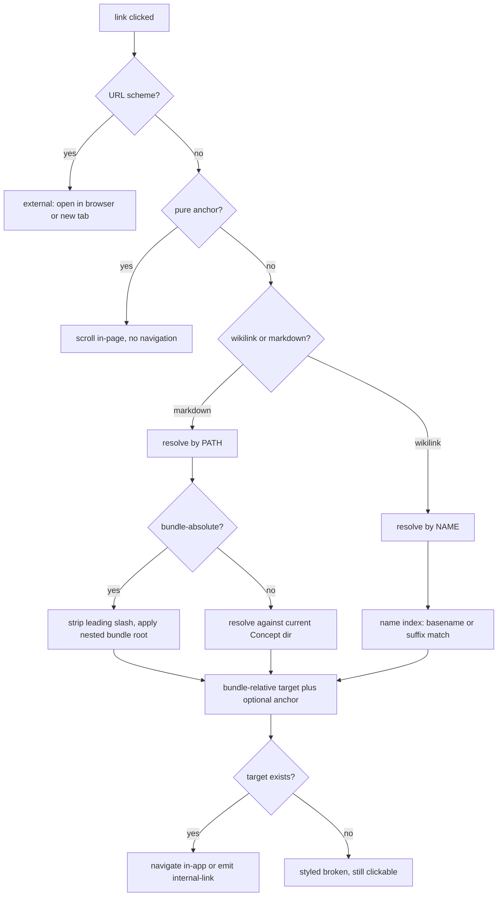

# Linking

Links are what turn a [Bundle](/GLOSSARY.md) of [Concepts](/GLOSSARY.md) into a wiki rather than a pile of files. Sunstone recognises **two distinct resolution models** side by side, plus anchors, citations, backlinks and automatic rewrite-on-move. This page is the map of all of them and the code that implements each.

The governing split — introduced by [ADR 0004](/adr/0004-wikilinks-optional-secondary-name-based.md):

- **Standard markdown links** (`[text](target)`) are the **primary/canonical** format and resolve by **path**. This is the only link form [OKF](/okf/spec.md#6-cross-linking-and-paths) itself defines.
- **[Wikilinks](/GLOSSARY.md)** (`[[name]]`) are an **optional, secondary fallback** format, supported *in addition to* — never replacing — markdown links, and resolve by **name**. They exist purely as an Obsidian-compatibility affordance for Bundles that originate as Obsidian vaults.

Both are tolerated when broken: a link whose target does not exist is styled distinct but stays clickable and never blocks editing (OKF [§6.1](/okf/spec.md#61-links-between-concepts)).

## The pure-logic seam

All link resolution is **pure, DOM-free, IPC-free logic** so it can be unit-tested, and since [ADR 0006](/adr/0006-wasm-shared-core-for-frontend-logic.md) it is implemented **once** — in [sunstone-shared](/architecture/sunstone-shared.md), compiled to both the native host and `wasm32`. The frontend runs the *same* code the desktop backend and the web renderer run, in-process and synchronously against the live editor buffer, so the two sides can no longer drift; the TypeScript twins that used to live in `src/lib/` were deleted.

| Concern | `sunstone-shared` | Frontend entry point (`src/lib/wasm/exports.ts`) |
|---------|-------------------|--------------------------------------------------|
| Markdown link resolution | `links.rs` (`resolve_link`), `paths.rs` (`is_external`, `normalize_segments`) | `resolveLinkIn` |
| Bundle root detection | `links.rs` (`find_bundle_root`) | via the index store |
| Wikilink parse + resolve | `wikilink.rs` (`resolve_wikilink`, `parse_target`, `parse_target_parts`) | `resolveWikilinkIn`, `splitWikilinkTarget` |
| Heading slugs | `slug.rs` (`slugify`, `slugify_headings`) | via `scanHeadings` / `rewriteAnchors` |
| Anchor rewrite | `rewrite/anchors.rs` (`rewrite_anchors_in`) | `rewriteAnchors` |
| Citation refs | `citations.rs` (`find_citation_refs`, `find_citation_defs`, `citation_def_pos`) | `findCitationRefs`, `citationDefPos` |
| Footnotes | `footnotes.rs` (`scan_footnotes`, `footnote_def_pos`, `source_ids`) | `scanFootnotes`, `footnoteDefPos`, `sourceIds` |
| Sources | `sources.rs` (`sources`, `source_list`, `resource_kind`) | `sourceList` |
| Rename/move rewrite | `rewrite/moves.rs` (`plan_rewrites`, `build_move_map`), `rewrite/relpath.rs` (path math) | `planMoveRewrites` (the fake backend's `planRewrites`) |

Rename/move rewrite has a single implementation too: native `rename_and_rewrite` drives it around the filesystem, and the fake backend's `planRewrites` hands its in-memory corpus to `planMoveRewrites`, so Chromium/Playwright exercise the same engine. The one remaining TS stand-in is the fake's Backlinks extraction (`outboundLinks` in `src/lib/ipc/fake/links.ts`, over the wasm resolvers). The CodeMirror extensions (`src/lib/editor/*.ts`) are the thin **view/authoring** layer over those wasm exports, never a second copy of the logic.



## Markdown links (the OKF link structure)

`resolve_link(current_path, href, …)` in `sunstone-shared/src/links.rs` — reached from the frontend as `resolveLinkIn` — classifies every markdown link `href` into a `ResolvedLink`:

```ts
type ResolvedLink =
  | { kind: 'external'; href: string }
  | { kind: 'internal'; path: string; anchor: string | null }
  | { kind: 'none' };
```

- **External** — anything matching a URL scheme (`http:`, `https:`, `mailto:`, `tel:`, any `scheme:`). Detected by `paths::is_external`; never navigated in-app — the caller hands it to the OS/browser.
- **Bundle-absolute** — begins with `/`, resolved from the Bundle root (leading slash stripped). The **recommended** form because it survives a Concept moving within its subdirectory.
- **Relative** — `./x.md`, `../y.md`, or a bare `x.md`, resolved against the *directory of the current Concept*.
- **Pure anchor** (`#heading`) or empty → `kind: 'none'`: there is no target Concept to open; the caller scrolls within the current Concept instead.

Path math is done by `paths::normalize_segments`, which collapses `.`/`..` and refuses to escape above the root (leading `..` that would escape are dropped, matching the backend's escape rejection). A `path#anchor` is split: the path resolves and the `#anchor` rides along on the result so the caller can scroll to that heading after navigating.

### Nested bundle root

The folder Sunstone opens is not always the OKF Bundle root — a repository commonly keeps its Bundle under `docs/`, and bundle-absolute links (`/x.md`) are authored relative to *that* root. `find_bundle_root(all_paths)` identifies the root **structurally** (paths only, never frontmatter):

1. Any top-level `.md` (a root `index.md` or a root-level Concept) → the opened folder **is** the root (`''`). Never redirect down; a Bundle at the opened root is the common case.
2. Otherwise the shallowest directory carrying an `index.md`; on a depth tie prefer the canonical `docs/`, else only commit when a single candidate is shallowest.
3. No `index.md` anywhere → the sole shared top-level segment if every Concept has one, else `''` (don't guess).

`applyBundleRoot` then prepends the identified root to a bundle-absolute target **only when the rewritten path actually exists** (`opts.exists`). This safe fallback means a mis-identified root can never mis-navigate a link that would otherwise have worked — a wrong guess simply leaves the link unrooted.

## Wikilinks (`[[name]]`) — the name-based fallback

Wikilinks are the compatibility fallback to markdown links. Unlike markdown links they resolve by **filename, not path** — a fundamentally different model that [ADR 0004](/adr/0004-wikilinks-optional-secondary-name-based.md) introduces deliberately, with the design rule **match Obsidian exactly**.

`splitWikilinkTarget(raw)` splits the inner text of `[[ … ]]` into three parts (`WikilinkParts` — mirrored by Rust's `WikiTarget`):

- `name` — the file-match portion (the alias begins at the first `|`; the anchor at the first `#` *in the name part*, so an `#` inside an alias is display text, not an anchor).
- `alias` — display text after `|` (`[[name|display]]`), kept verbatim.
- `anchor` — `#heading` target after `#`, kept verbatim.

`resolveWikilink(allPaths, sourcePath, rawTarget)` then resolves the `name`:

- Strip `|alias`, then `#anchor`, then trim; an **empty** name (`[[#heading]]`) **falls back to `sourcePath`** — a pure same-file anchor.
- Drop a trailing case-insensitive `.md`.
- Match **case-insensitively and literally** — no slug/space normalisation (`[[Live Preview]]` matches `Live Preview.md`, not `live-preview.md`). The frontmatter `title` **never** participates.
- A **bare name** matches by **basename**; a **partial path** (`[[folder/name]]`) matches by **path suffix** (the whole path, or ending in `/name`).
- **Ties resolve silently** to the shortest path (fewest `/` segments), then lexicographically — ambiguity is *not* flagged broken (Obsidian behaviour).
- No match → `null` → styled broken, exactly like a broken markdown link.

### Wikilink fallbacks, layered

"Fallback" applies at several levels here — worth naming explicitly because it's the subtle part:

1. **Format fallback** — wikilinks are the secondary format Sunstone falls back to *supporting* for Obsidian-authored content; markdown links remain canonical. OKF does not use them.
2. **Empty-name fallback** — `[[#heading]]` with no name falls back to the source Concept (same-file anchor).
3. **Label fallback** — `labelFor` (in `src/lib/editor/wiki-links.ts`) shows the author's written name (what Obsidian displays); when the name is empty it falls back to the resolved file's basename.
4. **Unresolved fallback** — a name that resolves to nothing, *or* resolves to a path absent from the index, falls through to broken styling rather than erroring.

### Rendering wikilinks

`src/lib/editor/wiki-links.ts` reuses atomic-editor's built-in `wikiLinks` CodeMirror extension with a Sunstone `resolve`/`onOpen` adapter: `resolve` runs the synchronous `resolveWikilink` against the same cached index `exists()` that the broken-link decoration uses; `onOpen` navigates in-app and best-effort scrolls to the `#anchor`. The extension's resolve cache has no invalidation API, so the host wraps it in a CodeMirror `Compartment` and reconfigures it whenever the index changes, piggybacking on the same index signal that refreshes broken markdown links.

Upstream styles *all* aliased links (`[[target|label]]`) as resolved and never runs `resolve()` on them, so a `brokenAliasWikiLinkOverlay` view-plugin adds a `cm-atomic-wiki-link-missing` mark to the label of any aliased wikilink whose target does not resolve — making both bare and aliased broken wikilinks read as broken. On the web, `render.rs` rewrites `[[wikilinks]]` into marked markdown links before parsing, so the read-only viewer resolves them by the identical rules.

## Anchors and heading slugs

An anchor is the `#fragment` of a link (`/page.md#deep-section`, `[[page#deep-section]]`). Anchor targets are **GitHub-style heading slugs**, computed by `slugify` in `sunstone-shared/src/slug.rs`:

- lowercase (Unicode-aware);
- drop everything that is not a letter, digit, hyphen, or underscore;
- turn each whitespace character into a hyphen (runs of spaces → runs of hyphens; not collapsed);
- `slugify_headings` de-duplicates repeated slugs in document order by appending `-1`, `-2`, … (two `## Notes` → `notes`, `notes-1`), so it must run over the whole ordered heading list, never per-heading.

`slugify` trims first, so a hand-typed literal anchor (`#Deep Section`) and the canonical slug (`#deep-section`) compare equal — matching is backward-compatible and migrates older literal anchors to the canonical slug on the first heading change.

## Citations

Sunstone recognises two related but distinct things under the citation banner:

- **OKF citation links** — entries under a `# Citations` heading (a v0.1 form, superseded in v0.2 by the `sources` frontmatter family — OKF [§13.1](/okf/spec.md#131-breaking-changes)), numbered `[n]` at line start, whose targets may be external URLs, bundle-relative paths, or pages in a `references/` subdirectory. These are ordinary markdown links; nothing special beyond the convention.
- **Citation references** — inline `[n]` tokens that *follow a word* (`…deep umami and body.[6][7][8]`), which render as clickable **superscripts** that jump to the matching row of the citation table.

`sunstone-shared/src/citations.rs` is the pure detector, exposed to the frontend through the wasm seam:

- `find_citation_refs(text)` (`findCitationRefs`) finds every inline `[n]` that is immediately preceded by a non-whitespace character other than `[` (a word, punctuation, the `]` of an adjacent citation as in `[6][7]`, or a `]]` wikilink close) and not followed by `]` (a `[[wikilink]]` close), `(` (a real markdown link `[6](url)`), or `:` (a reference-link definition `[6]:`). A `[n]` after any other bracketed label (`[text][1]`) is a reference-link label, not a citation. Line-start `[n]` (the table rows) fail the "preceded by non-space" test and are skipped, so they stay literal and act as jump targets.
- `find_citation_defs(text)` finds the definition rows: a `[n]` that is the first content of its line (after spaces/tabs only), passes the same trailer guard (so `[1](url)` and `[1]: url` stay markdown), and lies outside fenced code and inline code spans. The native render anchors exactly these rows (`id="cite-n"`).
- `citation_def_pos(text, num)` (`citationDefPos`) returns the offset of the first `find_citation_defs` row numbered `num`, or `null` for a dangling reference.

`src/lib/editor/citations.ts` is the thin CodeMirror layer: a `CitationWidget` superscript, a click handler that scrolls to the definition and briefly flashes it, active in hybrid + reading modes (in hybrid the raw token is revealed under the cursor for editing; absent in source `edit` mode).

The "follows a word" rule means a space-separated `text [6]` is **not** a citation reference. New documents should use footnotes (below) instead; the `/llm-wiki` skill's `migrate-footnotes.ts` script converts existing `[n]` documents.

### Footnotes

Markdown footnotes are the standard form of per-claim attribution (OKF v0.2 §5.1, and what GFM, pandoc and Obsidian understand). `sunstone-shared/src/footnotes.rs` is the detector:

- `scan_footnotes(text, source_ids)` (`scanFootnotes`) returns every footnote in document order. A **definition** is a `[^label]:` at the start of a line (after at most three spaces); its span runs through the `:`, and the footnote text after it stays ordinary markdown. Any other `[^label]` is a **reference**, unless it is preceded by `[` (a wikilink) or followed by `(` (a markdown link). A label is one or more characters other than whitespace and brackets, and labels match case-insensitively. Fenced code and inline code spans are skipped. Each footnote carries a display `num`, sequential by first reference (labels that are only defined follow in definition order), plus `has_def` (the body defines the label) and `defined` (it has a body definition **or** its label is one of `source_ids`, the Concept's `sources[].id`s; false for a dangling reference).
- `source_ids(yaml)` (`sourceIds`) reads the `sources[].id`s from a Frontmatter block.
- `footnote_def_pos(text, label)` (`footnoteDefPos`) returns the offset of the first definition of `label`, or `null`.

References show their **number**, without brackets, not the label: `[^ssi-web]` renders as a superscript `1` if it is the first label cited, and the label appears on hover. A reference that directly follows another (`[^a][^b]`, `follows_ref`) is separated by a comma, `1,2`, so the numbers do not run together. A label that matches a `sources[].id` is resolved without any body definition, as OKF v0.2 §5.1 intends, and **cites that source** ([ov-17](/tickets/okf-v02/ov-17-sources-section-and-source-links.md)): hover immediately shows a card with the entry (title, resource, then `author`, `last_modified`, `usage_count`; `src/lib/sourceCard.ts`), and a click opens the `resource` directly, a path as a Concept in the app and a URL in the browser. A `resource` with whitespace and no path prefix (`all queries in project X`) is a scope descriptor and is not clickable.

### Sources section

`sunstone-shared/src/sources.rs` reads the `sources` list: `sources(yaml)` in list order, `source_list(body, yaml)` for display, and `resource_kind` (URL, path, or descriptor; paths resolve like markdown links, a leading `/` from the Bundle root). Each entry carries `num`, the footnote number of the first `[^id]` citing it. Every Concept with `sources` shows them as a **Sources** section after the body: cited entries by number, then uncited ones unnumbered in list order, each with its title linking to the resource and the resource below it. The section exists only in the view, never in the file. The editor draws it as a block widget (`src/lib/editor/sources.ts`); the native render appends `<section class="sources">` (`render/footnotes.rs`, `sources_section_html`).

`src/lib/editor/footnotes.ts` mirrors the citation layer: a superscript widget that jumps to the definition and flashes it (the shared `jumpFlash.ts`), an `n` row-head widget over each definition marker (raw while the cursor is on that line in hybrid mode), and a dashed red, unclickable superscript for a dangling reference; it reads the source ids from `frontmatterField`. The native render's `render/footnotes.rs` emits the same through a sentinel pass: `<sup class="footnote-ref" title="label"><a href="#fn-label">n</a></sup>` (with a leading `,` inside the `<sup>` when it follows another reference) with a body definition, `<sup class="footnote-ref source" data-source="…">` linking to the resource for a `sources` id (unlinked for a scope descriptor; `data-source` is the entry as JSON, which the web viewer's hover card reads), the same without the link for a label defined some other way, a `<sup class="footnote-ref broken">` for a dangling one, and `<a id="fn-label" class="footnote-def">n</a>` at each definition, which stays where it was written. The `fn-` anchor is the label lowercased, so references match their definition in any case; the hover title keeps the label's spelling. comrak's own footnote extension is not used: its numbering and end-of-document section know nothing of `sources` and would disagree with the editor.

## Broken links

Broken links are **tolerated**, never blocked (OKF [§6.1](/okf/spec.md#61-links-between-concepts)). `src/lib/editor/broken-links.ts` walks the syntax tree, resolves each `Link` node's URL with `resolveLinkIn`, and marks it `cm-broken-link` (dashed/red) when it resolves to an internal target absent from the index — styling only; the link stays clickable. The check is synchronous against the frontend index store's cached path set (CodeMirror decorations cannot await IPC) and re-runs on doc changes and on an explicit `refreshBrokenLinks` effect (fired on the `file-changed` watcher event and on Concept switch, so created/removed targets restyle without a reload).

## Backlinks

The inverse of an outbound link. `Index::backlinks(path)` in `sunstone-native/src/index.rs` returns every Concept that links *to* a given Concept, powering the **Backlinks** [Section](/GLOSSARY.md) — reached as the `backlinks` Tauri command (`src-tauri/src/commands.rs`) on the desktop and `GET /_api/backlinks` on the server. It is built from outbound-link extraction in `sunstone-native/src/index/links.rs` over the `sunstone-shared` link/wikilink kernels, mirrored by `outboundLinks` in `src/lib/ipc/fake/links.ts`. Both markdown links and wikilinks feed backlinks; a link to a folder (`./sub/`, or `/` for the Bundle root) counts as a Backlink of that folder's `index.md`, the Concept it opens; self-edges (e.g. a pure same-file `[[#heading]]`) are dropped. Both halves run the shared code-aware scanner (`sunstone_shared::scan`; the fake reaches it through the wasm `markdownLinkHrefs` / `wikilinkRaws` exports): a wikilink inside fenced or inline code is never picked up, and a markdown link inside a fenced code block is no Backlink (one in an inline code span still is — the markdown-link half is code-agnostic, matching the move/rename rewrite).

## Rename & move rewrite

When a Concept or folder is renamed/moved, Sunstone **automatically rewrites the affected links** so nothing breaks — inbound links from other Concepts and the moved Concept's own outbound links. The engine is `plan_rewrites` in `sunstone-shared/src/rewrite/moves.rs` — run natively by `rename_and_rewrite` and, for the fake backend, through the `planMoveRewrites` wasm export:

- **Inbound absolute** links (`/old.md`) → the new absolute path.
- **Inbound & outbound relative** links → recomputed from the source's own directory, preserving relative style (`./`, `../`).
- **Folder links** (`./sub/`, `/sub`) open the folder's `index.md`, so they follow a **moved folder** (its `index.md` and every Concept under it moved) to the new folder path, keeping absolute vs relative and a trailing `/`. Renaming only a folder's `index.md` leaves them alone. The Bundle root (`/`) never moves; a moved Concept's relative root link (`./`) is recomputed like any relative link.
- **Wikilinks** (`[[old]]`, `[[a/old]]`) whose target moved are left **byte-for-byte** when the written name still resolves (by `resolve_wikilink`, over the post-move path set) to the moved Concept — so a pure folder move keeps `[[Old]]` or `[[old.md]]` as written. Otherwise the name becomes the **shortest suffix that resolves** to the new path: the new basename on a plain rename, or more segments when the basename alone would land on another Concept (`[[x]]` → `[[a/y]]` when renaming `a/x.md` to `a/y.md` next to a root `y.md`; `[[x]]` → `[[c/x]]` when a move makes `a/b/c/x.md` lose the fewest-`/` tie-break).
- `|alias`, `#anchor`, `?query`, link titles, link text and external links are all preserved verbatim; only links whose resolved target actually moved change.

Separately, `rewrite_anchors_in` (`sunstone-shared/src/rewrite/anchors.rs`, exposed as `rewriteAnchors`) rewrites the `#anchor` of every link pointing at a heading whose slug changed — both cross-file inbound links (via the backend) and same-file `[[#slug]]` links in the open editor buffer (`source === target`). Both sides are slugged before comparison, so an older literal anchor is migrated to the canonical slug on the first heading rename.

## Out of scope

Deferred per [ADR 0004](/adr/0004-wikilinks-optional-secondary-name-based.md): embeds (`![[ … ]]`), block references (`#^`), and `[[`-autocomplete. The wikilink scanner matches only `[[ … ]]`, so `![[ … ]]` renders as a literal `!` plus a wikilink.

## Related

- [Open Knowledge Format (OKF) Specification](/okf/spec.md) — §6 cross-linking and paths, §5.1 provenance, the format Sunstone's links conform to.
- [Concept](/okf/concept.md) and [Bundle](/okf/bundle.md) — how Sunstone models the units these links connect, and where it extends the spec.
- [Glossary](/GLOSSARY.md) — the **Wikilink**, **Backlinks**, and **Diagram** (graph sense) terms.
- [ADR 0004 — Wikilinks as an optional, name-based secondary link format](/adr/0004-wikilinks-optional-secondary-name-based.md).
- [Editor layout](/editor/editor-layout.md) — links open Concepts into Tiles.
